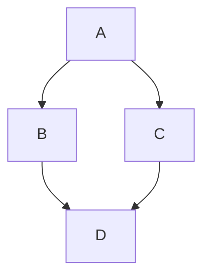

# Asymptotic Notations

Asymptotic notations define a bound on a function for large input. It can be used to categorize **monotonically increasing functions** in terms of their **upper-bound** or **lower-bound** or both.

> **Note:** In the study of algorithms, their complexities are almost always written in terms of a single-valued monotonically increasing function ($f$) whose domain is the input size for the algorithm (generally denoted as $n$) and the range is the time or the space taken by the algorithm for the given input size. Mathematically it can be written as,

> $f: \mathbb{Z}^+ \rightarrow \mathbb{Z}^+$, where $\forall x_0, x_1 \in \mathbb{Z}^+$, if $x_0 \le x_1$ then, $f(x_0) \le f(x_1)$

The types and different notations are listed below,

