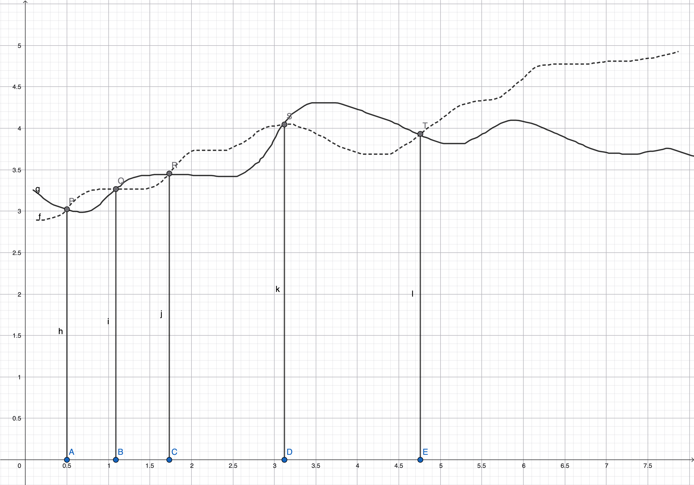

# Big 'Oh' $(\mathcal{O})$

A function $f(n)$ is said to be order (Big 'Oh') of another function $g(n)$ if and only if there exists two positive constants $c$ and $n_0$ such that,
$$
|f(x)| \le c \cdot |g(n)|, \quad \forall n \ge n_0
$$

If the above condition holds for two functions $f$ and $g$ then,

$$
|f(n)| = \mathcal{O}(g(n)) 
$$

It is read as $f(n)$ is $\mathcal{O}(g(n))$. This means that, $f(n) \in \mathcal{O}(g(n))$ as there can be several other functions other than $f$ which satisfies the Big 'Oh' condition for $g$

## Example

<!--  -->
<iframe scrolling="no" title="Big Oh " src="https://www.geogebra.org/material/iframe/id/vdvdz2mj/width/800/height/600/border/888888/sfsb/true/smb/false/stb/false/stbh/false/ai/true/asb/true/sri/false/rc/false/ld/false/sdz/false/ctl/false" width="800px" height="600px" style="border:0px;"> </iframe>