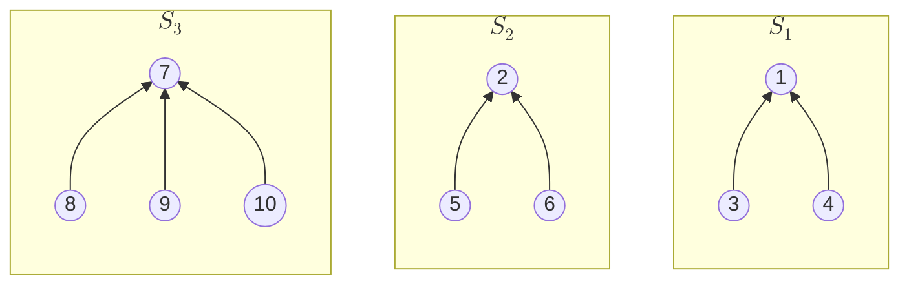

# Disjoint Set

Two sets $A$ and $B$ are said to be disjoint if and only if they do not have any common elements, i.e., 

$$
A \cap B = \phi
$$

## Application

If a set of items need to be grouped into separate categories then disjoint sets can be used.

**Example**: The set $N = \left\\{ 1, 2, 3, 4, 5, 6, 7, 8, 9, 10\right\\}$ can be split into three distinct sets like,

$$
S_1 = \left\\{ 1, 3, 4\right\\}; \quad S_2 = \left\\{2, 5, 6\right\\}; \quad S_3 = \left\\{7, 8, 9, 10\right\\}
$$

## Representation

A disjoint set can be represented with a tree where the elements are the elements of the set and the root element acts as the set identifier (as it won't be present in any other set because of the disjointness condition) and the edges are directed from child to parent to locate the set where elements lie.

A collection of disjoint sets can be represented with a forest i.e., a collection of trees without any common root.

**Example:**

Partition of $N$ into $S_1, S_2$ and $S_3$ can be represented as,

For simplicity, it is assumed that the domain of each set is $\mathbb{Z}^+$ i.e., set of positive integers. If partition of different types of sets (like Strings, characters, reals etc.) are to be done then Hashing can be used to map each item to an integer. Hashing can also be used to transform non-contagious items (like $\left\\{ 2, 5, 9, 10, 14\right\\}$) into contagious items (like $\left\\{ 1, 2, 3, \cdots \right\\}$) to make disjoint set operations easier.

## Representation in Memory

Disjoint sets can be represented in memory using an array which assumes the tree notation of the disjoint sets.

If the array is $p$ then,

$$
p\left\[i\right\] = 
\begin{cases}
-1 & \text{if } i \text{ is root}, \\\\
\text{parent of } i & \text{ otherwise}
\end{cases}
$$

**Example**:

$S_1, S_2$ and $S_3$ can be represented in memory like the following,

$$
p =
\begin{array}{r|c|c|c|c|c|c|c|c|c|c|}
\text{Indices} & 1 & 2 & 3 & 4 & 5 & 6 & 7 & 8 & 9 & 10 \\\\
\hline
\text{Array} & -1 & -1 & 1 & 1 & 2 & 2 & -1 & 7 & 7 & 7 \\\\
\hline
\end{array}
$$
