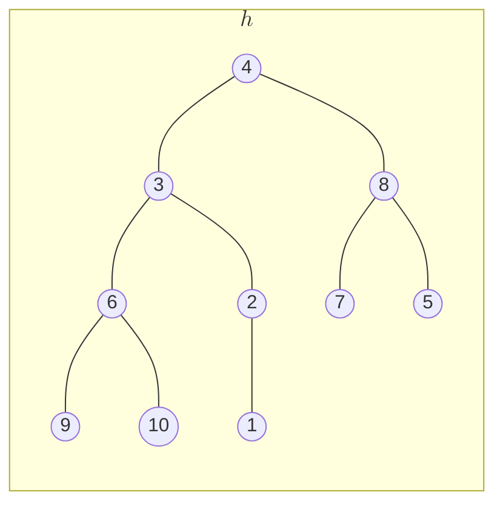
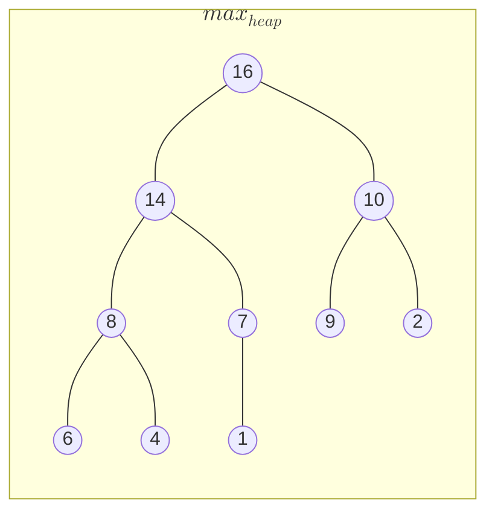
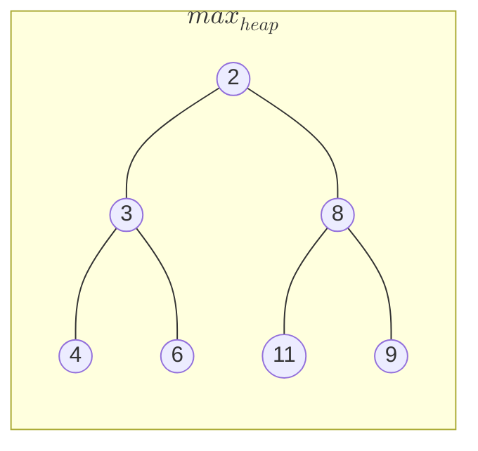

# Heap

A complete binary tree is called heap, if it follows either **max heap** or **min heap** property.

**Example:**

## Representation in memory

A complete binary tree can be represented in memory using an array with the following convention,
- $arr[i]$ is the node value/item of node $i$,
- Left child of $i$ is located at $2 \cdot i$,
- Right child of $i$ is located at $2 \cdot i + 1$,
- Parent of $i$ is located at $\lfloor \frac{i}{2} \rfloor$

**Example:**

The array representation of $h$ is,

$$
\begin{array}{|c|c|c|c|c|c|c|c|c|c|c|}
\hline
indices & 1 & 2 & 3 & 4 & 5 & 6 & 7 & 8 & 9 & 10\\\\
\hline
elements & 4 & 3 & 8 & 6 & 2 & 7 & 5 & 9 & 10 & 1 \\\\ \hline
\end{array}
$$

## Max Heap property

Given a complete binary tree, if all of it's parent nodes contain items greater than their child node's value then such a tree is called a **Max Heap** and it follows a **Max Heap** property

**Example:**

## Min Heap property

Given a complete binary tree, if all of it's parent nodes contain items smaller than their child nodes' values then such a tree is called a **Min Heap** and it follows the **Min Heap** property.

**Example:**

